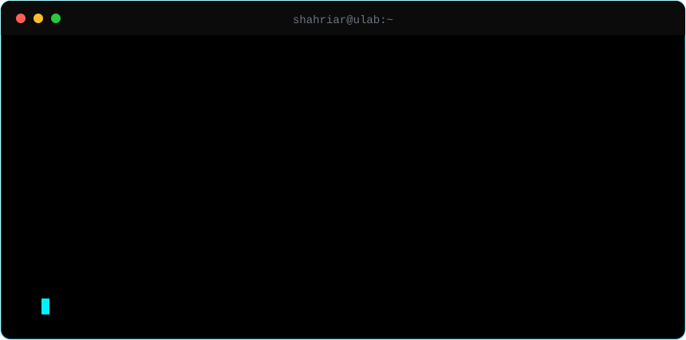
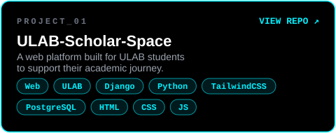
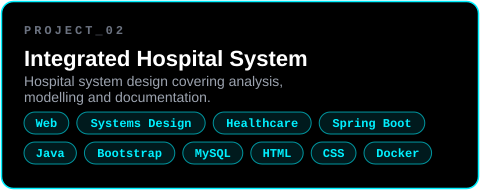
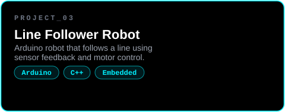
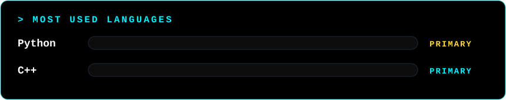

<table>
<tr>
<td></td>
<td></td>
</tr>
<tr>
<td colspan="2" align="center"></td>
</tr>
</table>

  
  
  

 

<b>🏆 Trophy cabinet</b>

 

<b>📈 Contribution graph</b>

 

<b>⚔️ Problem-solving arena</b>

 

- **Codeforces:** [`rahman4`](https://codeforces.com/profile/rahman4)
- **HackerRank:** [`srrifat578`](https://www.hackerrank.com/profile/srrifat578)

